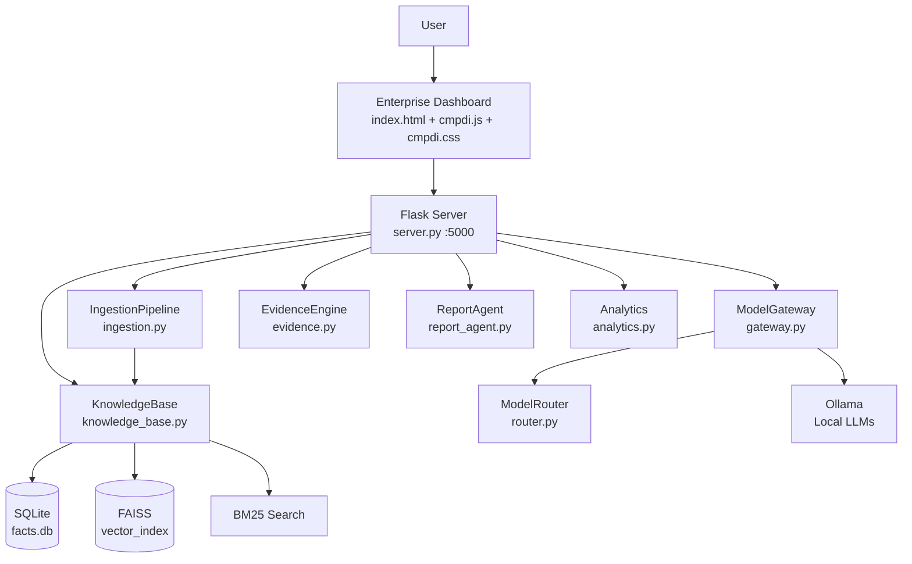

# ARIA-CIL — Walkthrough (Updated 22-Sep-2026)

## Summary

ARIA has been adapted into **ARIA-CIL** — a sovereign AI Document Intelligence Platform for CMPDI/CIL (Coal India Limited). The system is fully operational with an enterprise dashboard, multi-module backend, and local LLM inference via Ollama.

---

## Architecture

---

## Features Implemented

| Feature | Status | Notes |
|---------|--------|-------|
| Document Ingestion (PDF/DOCX/XLSX/Image) | OK | pdfplumber + pypdf + OCR |
| Fact Extraction (regex + LLM fallback) | OK | 79 facts from 1 test doc |
| Knowledge Base (SQLite + FAISS + BM25) | OK | Hybrid search working |
| Hybrid RAG Query + Evidence Tracing | OK | With offline KB fallback |
| Conflict Detection | OK | Cross-document contradiction scan |
| Parliamentary Query Agent | OK | Multi-step decomposition + DOCX |
| Report Generation (DOCX 8 sections) | OK | Self-verification loop active |
| Analytics (word cloud, topics, trend, comparison) | OK | Chart.js rendering |
| Voice Dictation (STT) | OK | faster-whisper on mic button |
| Multi-Model Routing | OK | 8 task types via router.py |
| Agent Orchestrator | OK | Plan->Execute->Verify->Replan |
| Tool Registry (11 tools) | OK | code/docx/xlsx/ocr/search |
| Enterprise Dashboard (6 tabs) | OK | dark navy design system |

---

## Frontend & UI/UX Enhancements (22-Sep-2026)

1. **Background Video Integration (`enchance_the_video_quality_int.mp4`)**:
   - Added backend route in `server.py`: `GET /enchance_the_video_quality_int.mp4` with `video/mp4` MIME type.
   - Embedded `<video id="bg-video" class="bg-video" autoplay muted loop playsinline preload="auto">` within `.bg-canvas`.
   - Added hardware-accelerated video background styling with subtle saturation/contrast filters and radial vignette overlay (`.bg-video-overlay`) ensuring 100% sharp text legibility and contrast.
   - Added interactive video ambience toggle in sidebar footer: switches between **High** (opacity 0.24), **Low** (opacity 0.10), and **Off** (paused) with local storage persistence.

2. **Frontend Bug Fixes**:
   - **Double file picker bug resolved**: Removed inline `onclick` handler on `.dropzone` that was conflicting with `cmpdi.js` event listener and triggering multiple file chooser dialogs.
   - **Dynamic API Host Detection**: Updated `API` constant to detect `window.location.origin` dynamically, allowing seamless direct access from `http://localhost:5000/`, `http://127.0.0.1:5000/`, or file URLs.
   - **Static Asset Serving in Flask**: Added direct routes for `/`, `/index.html`, `/cmpdi.css`, and `/cmpdi.js` in `server.py` so users can access the web application directly at `http://localhost:5000/` without needing an external static server.

3. **UI/UX & Aesthetics Upgrades**:
   - **Typography**: Integrated modern Google Fonts (`Plus Jakarta Sans` for headers/body, `JetBrains Mono` for code and metrics).
   - **Glassmorphism & Depth**: Applied refined frosted-glass surfaces (`rgba(15, 30, 52, 0.76)`, `backdrop-filter: blur(20px)`), smooth elevation transitions, and subtle cyan border glows on hover.
   - **Quick Query Experience**: Added suggested query pills ("CIL production 2023-24", "CMPDI seismic survey", "CCL resources"), animated searching spinner, and quick jump to full Query tab.
   - **Rich Markdown in Chat**: Integrated lightweight markdown parser rendering headers, bold, italics, code blocks, lists, and tables inside assistant messages.
   - **One-Click Copy**: Added response copy button to AI message bubbles.
   - **Responsive Navigation**: Added mobile topbar with slide-out sidebar drawer and responsive media queries for tablets and mobile displays.
   - **Keyboard Shortcuts**: Added `/` hotkey to quickly focus search/query inputs.

---

## Verification Summary

| Check | Result | Details |
|-------|--------|---------|
| `GET /api/health` | HTTP 200 | Returns `healthy`, `ollama_running: true`, `default_model: llama3.2` |
| `HEAD /enchance_the_video_quality_int.mp4` | HTTP 200 | Content-Type: `video/mp4`, Length: 4,233,370 bytes |
| `GET /` (with `Accept: text/html`) | HTTP 200 | Serves full `index.html` with background video tag |
| `GET /cmpdi.css` | HTTP 200 | Serves upgraded CSS design system |
| `GET /cmpdi.js` | HTTP 200 | Serves upgraded frontend JS logic |
| `POST /api/query` | HTTP 200 | Returns accurate answer with source citation (`chap1AnnualReport2026en.pdf`) |
- LLM-based features (query synthesis, report generation) require Ollama running
- Single ingested test document — more documents = better analytics/conflict detection
